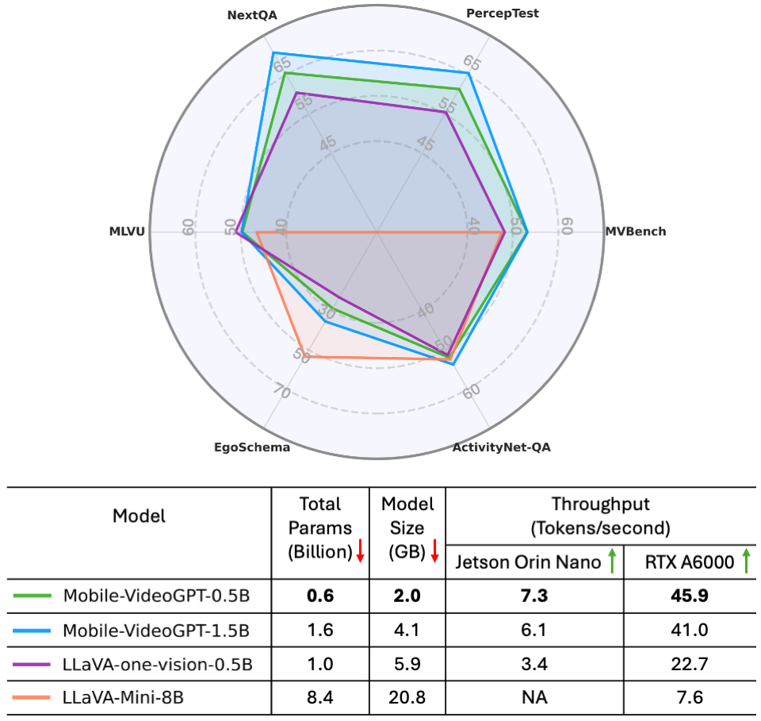
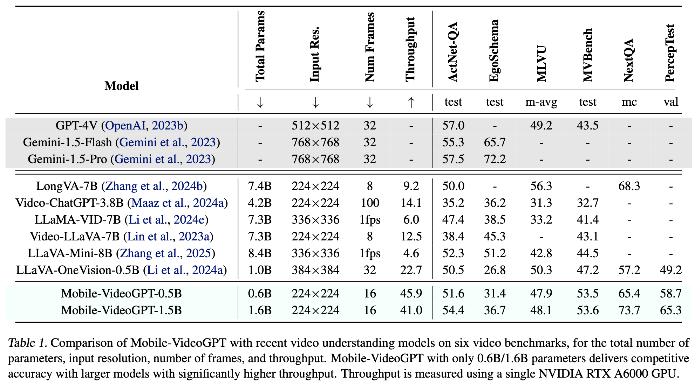
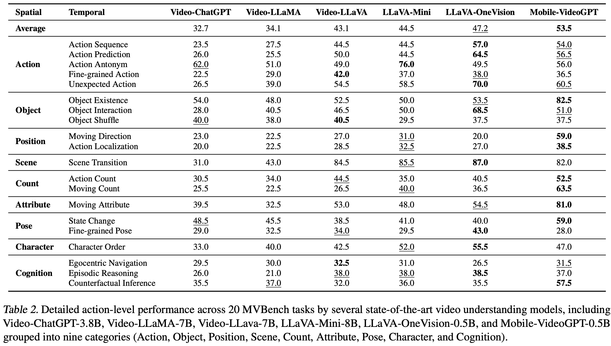
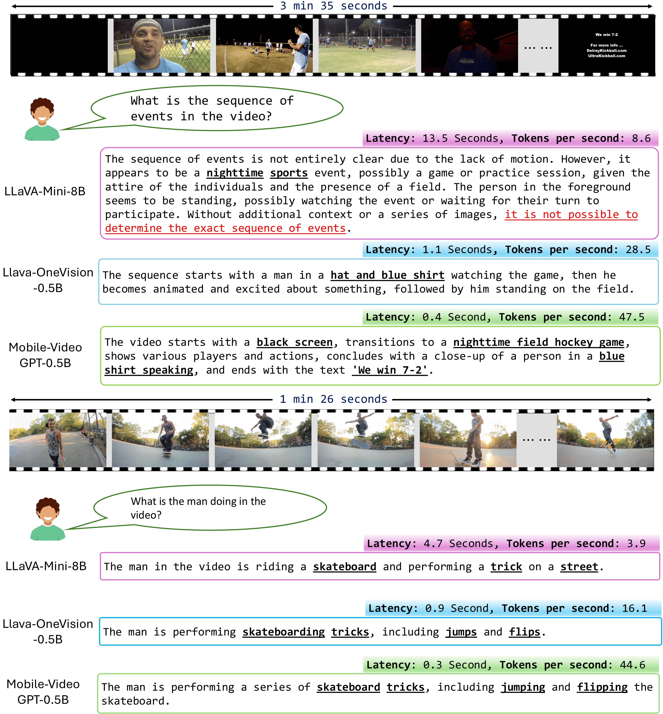
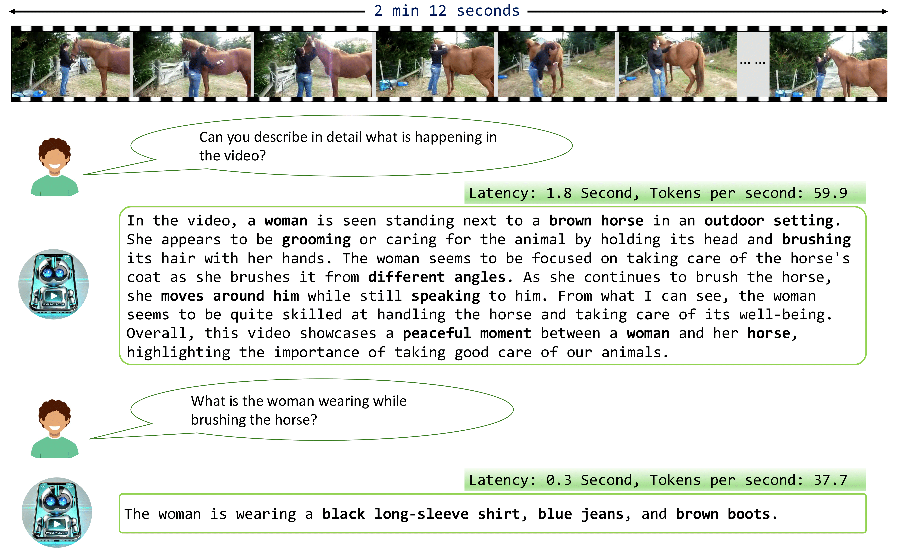

# Mobile-VideoGPT

<p align="center">
  
</p>

<p align="center">
    
</p>

### Mobile-VideoGPT: Fast and Accurate Video Understanding Language Model

#### [Abdelrahman Shaker](https://amshaker.github.io/)<sup>1</sup>, [Muhammad Maaz](https://www.mmaaz60.com/)<sup>1</sup> , [Chenhui Gou](https://scholar.google.com/citations?user=tlhShPsAAAAJ&hl=en)<sup>2</sup>, [Hamid Rezatofighi](https://scholar.google.com/citations?user=VxAuxMwAAAAJ&hl=en)<sup>2</sup>, [Salman Khan](https://salman-h-khan.github.io/)<sup>1</sup> and [Fahad Khan](https://sites.google.com/view/fahadkhans/home)<sup>1</sup>

#### **<sup>1</sup> Mohamed bin Zayed University of Artificial Intelligence**, <sup>2</sup>Monash University

---
[](https://arxiv.org/abs/2503.21782)
[](https://youtu.be/6Ueqq_D_mR0)
[](https://huggingface.co/collections/Amshaker/mobile-videogpt-fast-and-accurate-video-understanding-langu-67dc745074f8dd68d93b6b92)
[](https://amshaker.github.io/Mobile-VideoGPT/)

---


## :rocket: News
- **02-7-2025**: Deployed Mobile-VideoGPT-0.5B and LLaVa-One-Vision-0.5B on Jetson Orin Nano.
📈 Mobile-VideoGPT achieved 7.3 tokens/sec, more than 2× faster than LLaVa-One-Vision (3.4 tokens/sec). Mobile-VideoGPT is optimized for efficient on-device video understanding.   :fire::fire:
- **28-3-2025**: Mobile-VideoGPT paper, model checkpoints, training and evaluation codes are released. :fire::fire:
---

## Mobile-VideoGPT Overview:

we propose Mobile-VideoGPT, an efficient multimodal framework designed to operate with fewer than a billion parameters. Unlike traditional video large multimodal models, Mobile-VideoGPT consists of lightweight dual visual encoders, efficient projectors, and a small language model (SLM), enabling real-time inference on resource-constrained platforms. To further improve efficiency, we present an Attention-Based Frame Scoring mechanism to select the key-frames, along with an efficient token projector that prunes redundant visual tokens and preserves essential contextual cues. We evaluate our model across well-established six video understanding benchmarks (e.g., MVBench, EgoSchema, NextQA, and PerceptionTest), and our results show that Mobile-VideoGPT-0.5B can generate up to 46 tokens per second while outperforming existing state-of-the-art 0.5B-parameter competitors.

<p align="center">
  
</p>

---
## Evaluation Summary: Performance on 6 Benchmarks and Inference Throughput (Tokens per Second) on Jetson Orin Nano and RTX A6000

<p align="center">
  
</p>

## 🛠️ Installation 

We recommend setting up a conda environment for the project:
```shell
conda create --name=mobile_videogpt python=3.11
conda activate mobile_videogpt

git clone https://github.com/Amshaker/Mobile-VideoGPT
cd Mobile-VideoGPT

pip install torch==2.1.2 torchvision==0.16.2 --index-url https://download.pytorch.org/whl/cu118
pip install transformers==4.41.0

pip install -r requirements.txt

export PYTHONPATH="./:$PYTHONPATH"
```
Install [VideoMamba](https://github.com/OpenGVLab/VideoMamba). VideoMamba is the efficient video encoder in our architecture. Clone and install it using the following commands:
```shell
git clone https://github.com/OpenGVLab/VideoMamba
cd VideoMamba
pip install -e causal-conv1d
pip install -e mamba
```
Additionally, install [FlashAttention](https://github.com/HazyResearch/flash-attention) for training,
```shell
pip install ninja

git clone https://github.com/HazyResearch/flash-attention.git
cd flash-attention
python setup.py install
```
---

## 🔥 Running Inference

The following script demonstrates how to load Mobile-VideoGPT-1.5B, tokenize the input prompt, and generate a response:

```python
import sys
import torch
from pathlib import Path
from PIL import Image
from transformers import AutoTokenizer, AutoModelForCausalLM, AutoConfig

# Mobile-VideoGPT Imports
from mobilevideogpt.utils import preprocess_input

# Model and tokenizer paths
pretrained_path = "Amshaker/Mobile-VideoGPT-1.5B" 
video_path = "sample_videos/v_JspVuT6rsLA.mp4"
prompt = "Can you describe what is happening in the video in detail?"

# Load model and tokenizer
config = AutoConfig.from_pretrained(pretrained_path)
tokenizer = AutoTokenizer.from_pretrained(pretrained_path, use_fast=False)
model = AutoModelForCausalLM.from_pretrained(
    pretrained_path,
    config=config,
    torch_dtype=torch.float16
).cuda()

# Preprocess input
input_ids, video_frames, context_frames, stop_str = preprocess_input(
    model, tokenizer, video_path, prompt
)

# Run inference
with torch.inference_mode():
    output_ids = model.generate(
        input_ids,
        images=torch.stack(video_frames, dim=0).half().cuda(),
        context_images=torch.stack(context_frames, dim=0).half().cuda(),
        do_sample=False,
        temperature=0,
        top_p=1,
        num_beams=1,
        max_new_tokens=1024,
        use_cache=True,
    )
# Decode output
outputs = tokenizer.batch_decode(output_ids, skip_special_tokens=True)[0].strip()
if outputs.endswith(stop_str):
    outputs = outputs[:-len(stop_str)].strip()

print("🤖 Mobile-VideoGPT Output:", outputs)
```
✅ Expected Output:
```
🤖 Mobile-ViideoGPT Output:  In the video, a young boy is playing the violin in front of an adult who is playing the piano. The boy appears to be focused on his performance and is wearing a blue shirt with white stripes down the sleeves. He plays the violin with great concentration and skill, moving his fingers along the strings with precision. Meanwhile, the adult pianist sits behind him and plays the piano alongside him. Both musicians are dressed casually, suggesting that they may be practicing or performing for friends or family. The setting seems to be a cozy room with wooden flooring, giving it a warm and inviting atmosphere. Overall, this video showcases two talented musicians sharing a moment of musical collaboration, creating beautiful music together.
```
## Quantitative Evaluation 📊
We provide instructions on how to reproduce Mobile-VideoGPT-0.5B and Mobile-VideoGPT-1.5B results on MVBench, PerceptionTest, NextQA, MLVU, EgoSchema, and ActNet-QA. Please follow the instructions at [eval/README.md](eval/README.md).

### Benchmark Evaluation :bar_chart:
<p align="center">
  
</p>

---
### Detailed Evaluation on MVBench :movie_camera:
<p align="center">
  
</p>

---

## Training :train:
We provide unified scripts for pretraining and finetuning of Mobile-VideoGPT. Please follow the instructions at [scripts/README.md](scripts/README.md).

---
## Qualitative Examples:
Qualitative comparison between the proposed Mobile Video-GPT-0.5B, LLaVA-OneVision-0.5B, and LLaVa-Mini-8B. The output highlights both video comprehension quality and speed performance in terms of latency and throughput (tokens per second):

<p align="center">
  
</p>

---

<p align="center">
  
</p>

---

## Acknowledgements :pray:

Our codebase is built upon [Video-GPT+](https://github.com/mbzuai-oryx/Video-ChatGPT) and [LLaVA](https://github.com/haotian-liu/LLaVA). Their efforts in advancing multi-modal learning have greatly influenced our project.

## Citations 📜:

If you're using Mobile-VideoGPT in your research or applications, please cite using this BibTeX:
```bibtex
@article{Shaker2025MobileVideoGPT,
    title={Mobile-VideoGPT: Fast and Accurate Video Understanding Language Model},
    author={Shaker, Abdelrahman and Maaz, Muhammad and Gou, Chenhui and Rezatofighi, Hamid and Khan, Salman and Khan, Fahad Shahbaz},
    journal={arxiv},
    year={2025},
    url={https://arxiv.org/abs/2503.21782}
}
```

## License :scroll:
<a rel="license" href="http://creativecommons.org/licenses/by-nc-sa/4.0/"></a><br />This work is licensed under a <a rel="license" href="http://creativecommons.org/licenses/by-nc-sa/4.0/">Creative Commons Attribution-NonCommercial-ShareAlike 4.0 International License</a>.

Looking forward to your feedback, contributions, and stars! :star2:

If you have any questions, please create an issue on this repository or contact me at abdelrahman.youssief@mbzuai.ac.ae.

---
[](https://www.ival-mbzuai.com)
[](https://mbzuai.ac.ae)
