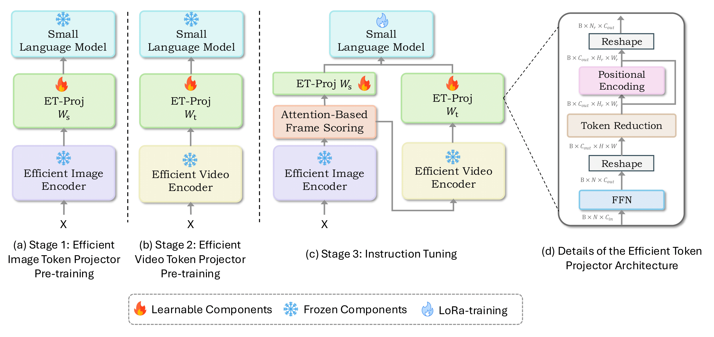

# Mobile-VideoGPT Training 🔥:
We train our models using the following three-stage process:

  

We provide unified scripts for projector pretraining and video fine-tuning Mobile-VideoGPT for 0.5B and 1.5B models. Please follow the instructions below:

## Download Pretraining Datasets:
You can download the pretraining and fine-tuning datasets from here: https://huggingface.co/datasets/MBZUAI/VideoGPT-plus_Training_Dataset/tree/main/pretraining

## Download Instruction-Tuning Datasets:
You can download the utilized instruction tuning dataset from (1) [VideoChat2-IT](https://huggingface.co/datasets/OpenGVLab/VideoChat2-IT). (2) PerceptionTest, and Academic_sources from [LLaVA-Video-178K](https://huggingface.co/datasets/lmms-lab/LLaVA-Video-178K). (3) Instruction-Tuning of [VideoGPT-plus](https://huggingface.co/datasets/MBZUAI/VideoGPT-plus_Training_Dataset/tree/main/instruction_tuning). 

## Mobile-VideoGPT-0.5B Training:
Run the three-stage training pipeline using the script: [Mobile-VideoGPT-0.5B_training.sh](Mobile-VideoGPT-0.5B_training.sh). It contains (1) Image projector pertaining, (2) Video projector pretraining, and (3) video instruction fine-tuning for Mobile-VideoGPT-0.5B.

## Mobile-VideoGPT-1.5B Training:
Run the three-stage training pipeline using the script: [Mobile-VideoGPT-1.5B_training.sh](Mobile-VideoGPT-1.5B_training.sh). It contains (1) Image projector pertaining, (2) Video projector pretraining, and (3) video instruction fine-tuning for Mobile-VideoGPT-1.5B.

